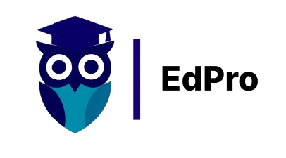

# 🎓 EdPro – Plataforma de Aprendizagem Corporativa

<div align="center">



**Interface web moderna e intuitiva para o sistema de aprendizagem corporativa EdPro**

[](https://nextjs.org/)
[](https://reactjs.org/)
[](LICENSE)
[]()

</div>

## 🚀 Visão Geral

O **EdPro Front-End** é uma aplicação web moderna desenvolvida com Next.js que oferece uma experiência completa para gestão e consumo de cursos corporativos. A plataforma foi projetada com foco na usabilidade, performance e escalabilidade.

### 👥 Perfis de Usuário

**🔧 Administrador**

- Criação e gestão completa de cursos
- Gerenciamento de módulos e lições
- Controle de alunos e matrículas
- Dashboard com métricas e indicadores
- Controle de publicação de conteúdo

**🎓 Colaborador (Aluno)**

- Acesso personalizado aos seus cursos
- Visualização de progresso em tempo real
- Player integrado para conteúdo multimídia
- Sistema de conclusão de lições
- Navegação intuitiva entre módulos

## ✨ Funcionalidades Principais

### 🛡️ Administração

- [x] **Autenticação e autorização** completa
- [x] **Dashboard administrativo** com KPIs
- [x] **CRUD de Cursos** com categorização
- [x] **CRUD de Módulos** organizados por curso
- [x] **CRUD de Lições** (vídeo, texto, anexos, quizzes)
- [x] **Gestão de Alunos** com controle de matrículas
- [x] **Relatórios de progresso** detalhados
- [x] **Sistema de publicação** com controle de versão

### 🎯 Portal do Aluno

- [x] **Login seguro** de colaboradores
- [x] **"Meus Cursos"** com visualização de progresso
- [x] **Player multimídia** responsivo
- [x] **Marcação de conclusão** automática e manual
- [x] **Navegação fluida** entre conteúdos
- [x] **Certificados** de conclusão
- [x] **Favoritos** e histórico de acesso

## 🏗️ Tecnologias e Arquitetura

### Frontend Stack

```
🚀 Next.js 16.0.1      - Framework React full-stack
⚛️  React 19.2.0       - Biblioteca de interface
🎨 CSS Modules         - Estilização modular e isolada
🔍 ESLint              - Linting e qualidade de código
📱 Design Responsivo   - Mobile-first approach
```

### Ferramentas de Desenvolvimento

- **Webpack** - Bundling otimizado
- **Hot Reload** - Desenvolvimento ágil
- **TypeScript Ready** - Tipagem estática (configurável)
- **PWA Ready** - Progressive Web App

## 🔗 Integração com Back-End

A comunicação é realizada via **API REST** com endpoints padronizados:

| Endpoint        | Método                 | Descrição                 |
| --------------- | ---------------------- | ------------------------- |
| `/auth/login`   | POST                   | Autenticação de usuários  |
| `/auth/refresh` | POST                   | Renovação de tokens       |
| `/courses`      | GET, POST, PUT, DELETE | CRUD de cursos            |
| `/modules`      | GET, POST, PUT, DELETE | CRUD de módulos           |
| `/lessons`      | GET, POST, PUT, DELETE | CRUD de lições            |
| `/users`        | GET, POST, PUT, DELETE | Gestão de usuários        |
| `/enrollments`  | GET, POST, DELETE      | Matrículas em cursos      |
| `/progress`     | GET, PUT               | Progresso dos alunos      |
| `/certificates` | GET, POST              | Certificados de conclusão |

## 📁 Estrutura do Projeto

```
edpro-frontend/
├── 📂 public/                  # Arquivos estáticos
│   ├── 📂 fonts/              # Fontes personalizadas
│   ├── 📂 icons/              # Ícones e favicons
│   ├── 📂 images/             # Imagens e logos
│   └── 📂 media/              # Arquivos de mídia
├── 📂 src/
│   ├── 📂 app/                # App Router (Next.js 13+)
│   │   ├── 📄 layout.js       # Layout principal
│   │   ├── 📄 page.jsx        # Página inicial
│   │   ├── 📄 globals.css     # Estilos globais
│   │   ├── 📂 admin/          # Área administrativa
│   │   ├── 📂 student/        # Portal do aluno
│   │   ├── 📂 auth/           # Autenticação
│   │   └── 📂 api/            # API Routes (opcional)
│   ├── 📂 components/         # Componentes reutilizáveis
│   │   ├── 📂 ui/             # Componentes de interface
│   │   ├── 📂 forms/          # Formulários
│   │   └── 📂 layout/         # Componentes de layout
│   ├── 📂 lib/                # Utilitários e configurações
│   │   ├── 📄 api.js          # Cliente HTTP
│   │   ├── 📄 auth.js         # Lógica de autenticação
│   │   └── 📄 utils.js        # Funções auxiliares
│   ├── 📂 hooks/              # Custom React Hooks
│   ├── 📂 context/            # Context API
│   └── 📂 styles/             # Estilos modulares
├── 📄 package.json            # Dependências do projeto
├── 📄 next.config.mjs         # Configuração do Next.js
├── 📄 eslint.config.mjs       # Configuração do ESLint
└── 📄 jsconfig.json           # Configuração do JavaScript
```

## 🚀 Início Rápido

### Pré-requisitos

- **Node.js** 18+
- **npm**, **yarn**, **pnpm** ou **bun**
- **Git**

### Instalação

1. **Clone o repositório**

```bash
git clone https://github.com/souzabweatriz/atividadedearray.git
cd edpro-frontend
```

2. **Instale as dependências**

```bash
npm install
# ou
yarn install
# ou
pnpm install
```

3. **Configure as variáveis de ambiente**

```bash
# Crie o arquivo .env.local
cp .env.example .env.local

# Edite as variáveis necessárias
NEXT_PUBLIC_API_URL=http://localhost:8000/api
NEXT_PUBLIC_APP_NAME=EdPro
```

4. **Execute o projeto em desenvolvimento**

```bash
npm run dev
# ou
yarn dev
# ou
pnpm dev
```

5. **Abra no navegador**

```
http://localhost:3000
```

### Scripts Disponíveis

```bash
# Desenvolvimento com hot reload
npm run dev

# Build para produção
npm run build

# Executar versão de produção
npm start

# Linting do código
npm run lint
```

## 🎨 Customização e Temas

O EdPro Front-End suporta temas customizáveis através de CSS Variables:

```css
:root {
  --primary-color: #3b82f6;
  --secondary-color: #1e40af;
  --success-color: #10b981;
  --warning-color: #f59e0b;
  --error-color: #ef4444;
}
```

## 📱 Responsividade

A aplicação é **mobile-first** e oferece suporte completo para:

- 📱 **Mobile** (320px+)
- 📟 **Tablet** (768px+)
- 💻 **Desktop** (1024px+)
- 🖥️ **Large Desktop** (1440px+)

## 🔒 Segurança

- **JWT Authentication** com refresh tokens
- **HTTPS** obrigatório em produção
- **Sanitização** de inputs do usuário
- **CORS** configurado adequadamente
- **Rate limiting** para APIs

## 🚀 Deploy e Produção

### Vercel (Recomendado)

```bash
# Install Vercel CLI
npm i -g vercel

# Deploy
vercel --prod
```

### Outros Provedores

- **Netlify** - Suporte completo ao Next.js
- **AWS Amplify** - Integração com AWS
- **Railway** - Deploy simples e rápido

## 📊 Performance

- **Lighthouse Score**: 95+ (Performance, Acessibilidade, SEO)
- **Core Web Vitals**: Todas as métricas no verde
- **Bundle Size**: Otimizado com code splitting
- **Image Optimization**: Next.js Image component

## 🤝 Contribuição

Contribuições são muito bem-vindas! Para contribuir:

1. **Fork** o projeto
2. Crie uma **branch** para sua feature (`git checkout -b feature/nova-funcionalidade`)
3. **Commit** suas mudanças (`git commit -m 'Adiciona nova funcionalidade'`)
4. **Push** para a branch (`git push origin feature/nova-funcionalidade`)
5. Abra um **Pull Request**

### Guidelines de Contribuição

- Siga os padrões de código definidos pelo ESLint
- Adicione testes para novas funcionalidades
- Documente mudanças significativas
- Mantenha commits pequenos e descritivos

---

## 👥 Participantes da Equipe

|                                  Foto                                  | Nome                          |       Função        | GitHub                                             | E-mail                            |
| :--------------------------------------------------------------------: | :---------------------------- | :-----------------: | :------------------------------------------------- | :-------------------------------- |
|      | Ana Beatriz de Souza Oliveira | Product Owner (P.O) | [@souzabweatriz](https://github.com/souzabweatriz) | ana.b.oliveira56@aluno.senai.br   |
|          | Anna Beatriz Leme Alves       | Scrum Master (S.M)  | [@annabialeme](https://github.com/annabialeme)     | anna.b.alves7@aluno.senai.br      |
|  | Anna Beatriz Ribeiro Valentim |   Desenvolvedora    | [@annabeatriz17](https://github.com/annabeatriz17) | anna.b.valentim@aluno.senai.br    |
|     | Beatriz Lima                  |   Desenvolvedora    | [@limabea23](https://github.com/limabea23)         | beatriz.lima14@aluno.senai.br     |
|       | Isabella Borin de Moraes Rosa |   Desenvolvedora    | [@isabella](https://github.com/isab5)              | isabella.b.rosa6@aluno.senai.br   |
|             | Luana Domeneghetti            |   Desenvolvedora    | [@domeneghettii](https://github.com/domeneghettii) | luana.domeneghetti@aluno.senai.br |
|             | Maria Eduarda da Silva Parma  |   Desenvolvedora    | [@Mariaparma](https://github.com/Mariaparma)       | maria.parma@aluno.senai.br        |

## 📄 Licença

Este projeto está sob a licença **MIT**. Veja o arquivo [LICENSE](LICENSE) para mais detalhes.

---

<div align="center">

**Desenvolvido com ❤️ pela equipe EdPro**

[🌐 Website](https://edpro.com) • [📧 Contato](mailto:contato@edpro.com) • [📱 LinkedIn](https://linkedin.com/company/edpro)

</div>
